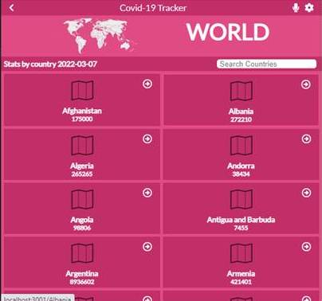

# Covid-19 Tracker Application

This is Microverse project for learning how to build React application, consuming [Narativa API](https://covid19tracking.narrativa.com/), using Redux for menaging state and dynamic routing.

## Built With

- ReactJS
- Redux and react-redux

## Live Demo

[Live Demo Link](https://angry-minsky-4e74f5.netlify.app)

## Installation

Go to your terminal, navigate to your working directory and run

`git clone https://github.com/Nuri1977/covid-19-tracker.git`

After that navigate to the newly created folder

`cd covid-19-tracker`

You now have access to the files.
To install necessary dependencies run

`npm install`

Start a local server running the command

`npm start`

You should now have the project running locally on a dev server.

`npm test`

Launches the test runner in the interactive watch mode.

## Author

👤 **Nuri Lacka**

- GitHub: [@Nuri1977](https://github.com/Nuri1977)
- Twitter: [@Lackanuri](https://twitter.com/LackaNuri)
- LinkedIn: [@nurilacka](https://www.linkedin.com/in/nuri-lacka-7141b01ba/)

## 🤝 Contributing

Contributions, issues, and feature requests are welcome!

Feel free to check the [issues page](../../issues/).

## Show your support

Give a ⭐️ if you like this project!

## Acknowledgments
- [Microverse Inc](https://www.microverse.org/)
- Design from [Nelson Sakwa on Binance](https://www.behance.net/sakwadesignstudio?isa0=1)
- [NARATIVA COVID API](https://covid19tracking.narrativa.com/)
- FontAwsome for free icons
